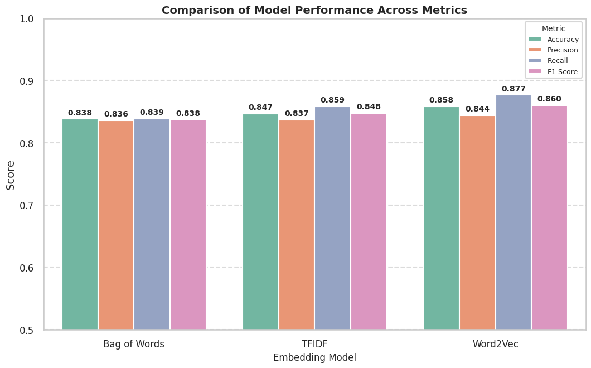

# 🎬 IMDB Sentiment Analysis - Movie Reviews

This project performs binary sentiment classification (Positive / Negative) on the IMDB dataset using multiple natural language processing techniques and machine learning models.

---

## 📁 Dataset Info

- **Source**: [Kaggle - IMDB Dataset of 50K Movie Reviews](https://www.kaggle.com/datasets/lakshmi25npathi/imdb-dataset-of-50k-movie-reviews/data)  
- **Original Paper & Data**: [Stanford AI - Maas et al.](http://ai.stanford.edu/~amaas/data/sentiment/)
- **Total Reviews**: 50,000
  - 25,000 for training
  - 25,000 for testing
- **Labels**: `positive` or `negative` (binary classification)

---

## 🧠 Techniques & Models Used

### 📊 Preprocessing
- Lowercasing, removal of non-alphabetic characters
- Tokenization using `nltk`
- Stopwords removal
- Stemming and Lemmatization

### 🧰 Vectorization Techniques
- Bag of Words (BoW)
- TF-IDF
- Word2Vec (Trained from scratch)

### 🧪 Models Trained
- Multinomial Naive Bayes (for BoW and TF-IDF)
- MLPClassifier (for Word2Vec)

---

## 📈 Evaluation Metrics

Each model is evaluated using the following metrics:
- Accuracy
- Precision
- Recall
- F1 Score

---

## 🖼️ Performance Comparison

The following plot shows a comparison of all three models on Accuracy, Precision, Recall, and F1 Score.

  

---

